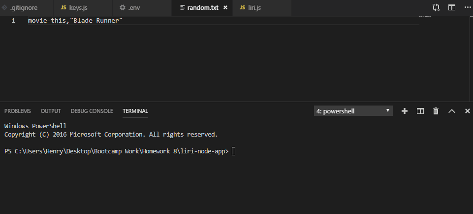

# LIRI Bot
### Language Interpretation and Recognition Interface

### This is a Node CLI application! You will need the following NPM packages:
* moment
* dotenv
* node-spotify-api
* axios

## GIF Demo

## How to use:
Type in one of the following commands with your query in this format: [node liri 'command' 'query']
* concert-this: Search for concerts for a specific band or artist.
* spotify-this-song: Look up details for a specific song title.
* movie-this: Look up details for a specific movie title.
* do-what-it-says: Performs the function with the query stated in the random.txt file.

## How does it work?
The JS file takes in a user input and creates a query string. Then using a switch case, a specific function is called depending on the command input from the user.

The concert-this function looks up and logs concerts using an axios call to the Bands In Town API. 

The spotify-this-song function uses the Spotify api and keys stored in a separate dotenv file along with the Spotify NPM package to get details on a specific song.

The movie-this function uses the OMDB api and an axios call to look up and log movie details. If no user query is provided, the movie "Mr. Nobody" will be displayed.

The do-what-it-says function uses node's FS package to read from a random.txt file and perform the function mentioned in the first line.

All logging is done through the doubleLog() function, which combines console.log() and fs.appendFile() to write to the console and log text file at the same time.
